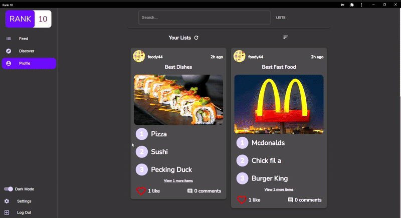

# Rank 10 React App


Rank 10 is a platform that allows users to create and share top ten lists on any topic. This repository is a web client for Rank 10 built using the React library and Material-UI.

## Features
- Create and customize an account with a profile picture and a bio that can display interests
- Easily create and edit top ten lists that are either private or public
- Drag and drop to quickly reorder rankings within your list
- Follow other users with similar interests to see what lists they create
- Discover new lists
- Search for lists on topics that interest you
- Like lists that catch your interest to have quick access to them through your profile
- Comment on lists
- Dark mode

## Showcase


## Running Locally
To run this react app, you must have Node and NPM installed on your machine.
Clone the repository and cd into the project directory. Create a file named config.js in the src directory with the following contents:
```js
export const baseUrl = "http://localhost:3000";
```

Then run the following commands in the project directory:
```
npm install
```

```
npm start
```
Make sure you have an instance of the [Rank 10 API](https://github.com/meh430/rankten-express) running as well!
